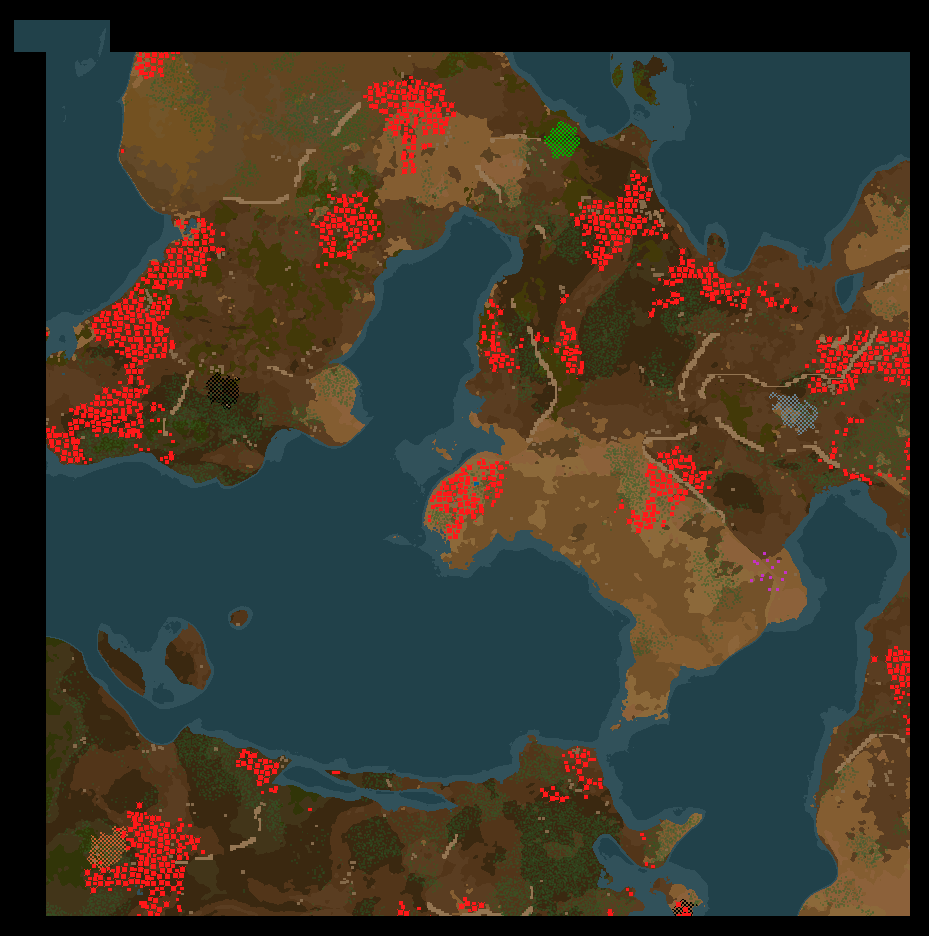

# Radar MK2

A radar with extended range, increased scanning speed, and more efficient energy usage. This allow for 64x64 chunk aligned radar coverage at legendary.

Check out my other chunk aligned mods:

- [Substation MK2](https://mods.factorio.com/mod/mklv-utility-station-mk2): full chunk coverage at legendary
- [Roboport MK2](https://mods.factorio.com/mod/mklv-utility-station-mk2): 2 chunk coverage at normal and increased charging speed at legendary
- [Utility Station MK2](https://mods.factorio.com/mod/mklv-utility-station-mk2): Combine Roboports, Substation, and optionally Radars or Lightning Collectors into a single structure

## Overview

Adds a radar MK2 that can be better chunk aligned:

- Increases the nearby sector scan from 7x7 to 9x9 chunks (must be odd)
  - +2 for each quality level up to 19x19
- Increases the sector scanning from 29x29 to 55x55 chunks (must be odd)
  - +2 for each quality level up to 65x65
- Energy usage doubled from 300kW to 600kW resulting in faster scans
- Sector scan energy decreased from 10MW to 8MW resulting in more energy efficient scans
- Does not circuit connect to other radars
- Assembled in Foundries on Gleba with Tungsten Plates
