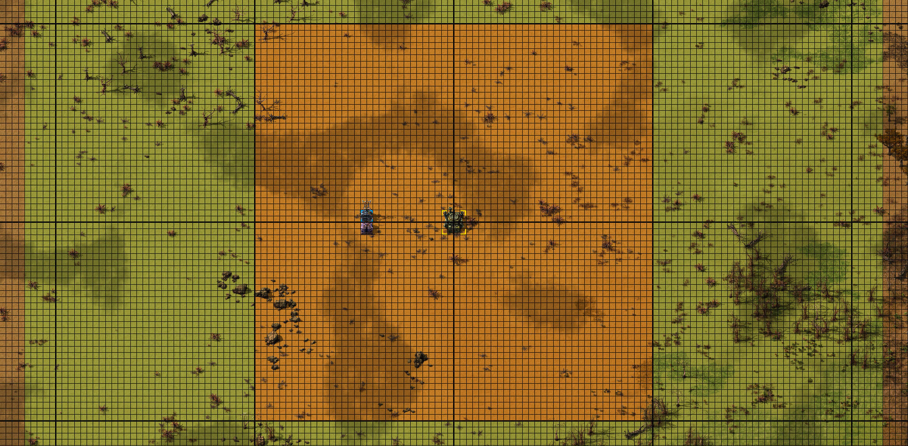

# Roboport MK2

A Roboport with extended range for chunk aligned logistics coverage.

Check out my other chunk aligned mods:

- [Radar MK2](https://mods.factorio.com/mod/mklv-radar-mk2): 64x64 chunk coverage at legendary
- [Substation MK2](https://mods.factorio.com/mod/mklv-substation-mk2): full chunk coverage at legendary
- [Utility Station](https://mods.factorio.com/mod/mklv-utility-station): Combine Roboports and Substations into a single 4x4 structure
- [Utility Station MK2](https://mods.factorio.com/mod/mklv-utility-station-mk2): Combine Roboports and Substations; and optionally Radars or Lightning Collectors into a single 2x2 structure

## Overview

Adds a Roboport MK2 that can be chunk aligned in a 64x64 grid:

- Increases the supply area from 50x50 to 64x64
- Increases the construction area from 110x110 to 138x138
- Increases the radar range from 2 to 4
- Increases the robot and items slots from 7 to 10
- Increases the energy stats from 1x to 2x
- Increases the number of robot charging slots with quality from 11 at normal to 16 at legendary
- Assembled in Cryogenic Labs on Fulgora with Lithium Plates and Quantum Processors
