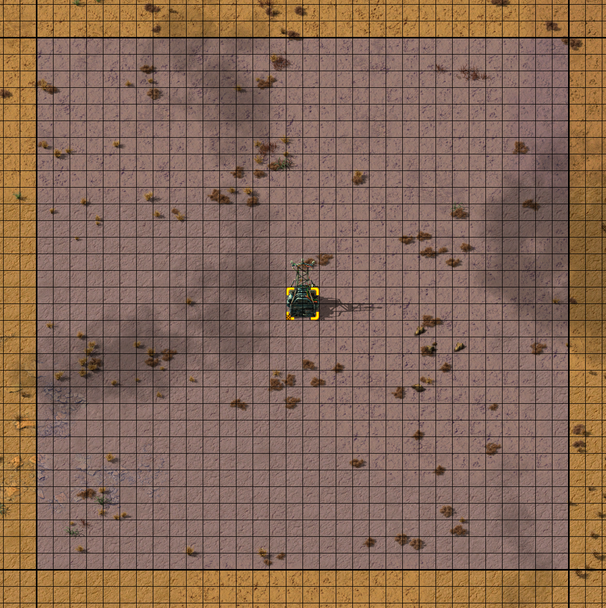

# Substation MK2

A Substation with extended range for chunk aligned power coverage at legendary.

Check out my other chunk aligned mods:

- [Radar MK2](https://mods.factorio.com/mod/mklv-radar-mk2): 64x64 chunk coverage at legendary
- [Roboport MK2](https://mods.factorio.com/mod/mklv-roboport-mk2): 2 chunk coverage at normal and increased charging speed at legendary
- [Utility Station](https://mods.factorio.com/mod/mklv-utility-station): Combine Roboports and Substations into a single 4x4 structure
- [Utility Station MK2](https://mods.factorio.com/mod/mklv-utility-station-mk2): Combine Roboports and Substations; and optionally Radars or Lightning Collectors into a single 2x2 structure

## Overview

Adds a Substation MK2 that can be chunk aligned in a 32x32 grid at legendary quality:

- Increases the wire distance and supply area at legendary from 28x28 to 32x32
- Assembled in Electromagnetic Plants on Aquilo with Substation, Superconductors, and Efficiency Module 3s
