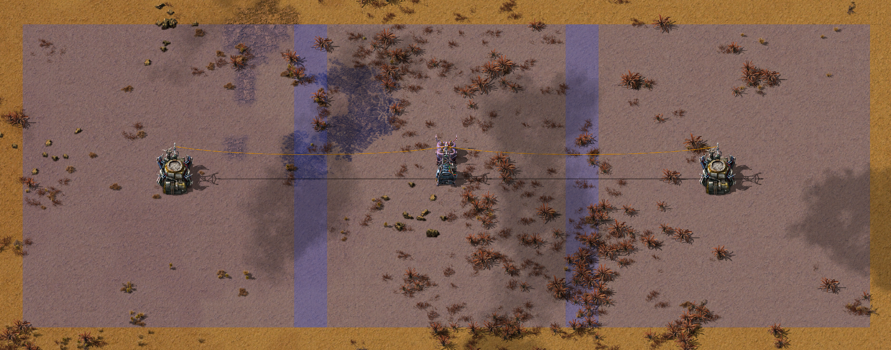

# Utility Station

A Utility Station that combines the properties of a Roboport and Substation into a single 4x4 structure.

Check out my other chunk aligned mods:

- [Radar MK2](https://mods.factorio.com/mod/mklv-radar-mk2): 64x64 chunk coverage at legendary
- [Roboport MK2](https://mods.factorio.com/mod/mklv-roboport-mk2): 2 chunk coverage at normal and increased charging speed at legendary
- [Substation MK2](https://mods.factorio.com/mod/mklv-substation-mk2): full chunk coverage at legendary
- [Utility Station MK2](https://mods.factorio.com/mod/mklv-utility-station-mk2): Combine Roboports and Substations; and optionally Radars or Lightning Collectors into a single 2x2 structure

## Overview

Adds a Utility Station that combines the functions of a Roboport and Substation, and optionally Lightning Collector or Radar:

- Created by putting an uninteractable Substation under the Roboport - no effect on UPS.
- Circuit connections extended reach substations.
- Due to Factorio limtations the circuit wires may not perfectly align with the substation.
- All other properties of a Roboport and Substation are kept the same.
- Assembled in a Biochamber on Vulcanis with wood and raw fish.
